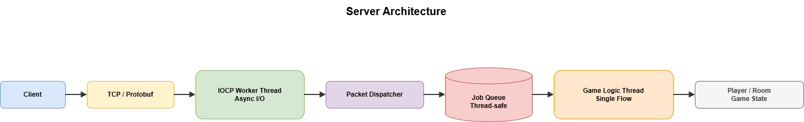

# MMO Server Test

C#과 .NET 기반으로 구축한 실시간 MMO 게임 서버입니다. 단순한 기능 구현을 넘어,  
**대규모 트래픽 처리를 위한 비동기 구조**와 **데이터 무결성**을 고려한 멀티스레드 설계를 목표로 개발했습니다.

---

## 실행 화면 (Demo)

### 다중 클라이언트 이동 동기화 

- 두 개의 Unity 클라이언트가 서버에 동시에 접속
- 한 클라이언트의 이동 입력이 서버를 통해 다른 클라이언트에 동기화

### 서버 로그 (IOCP 기반 네트워크 처리)
- 스레드에서 클라이언트 연결 및 패킷 수신 처리

---

## 기술 스택

### Server
- Language: C#
- Network: Windows IOCP (TCP)
- Serialization: Protobuf
- Concurrency: Job Queue 기반 구조

### Client
- Engine: Unity
- Language: C#
- Role: 입력 처리 및 서버 상태 반영

---

## 핵심 설계 포인트

- IOCP 기반 비동기 네트워크 모델로 동시 접속 확장성 고려
- 네트워크 I/O와 게임 로직 분리를 위한 Job Queue 도입

---

## 아키텍처 개요

- IOCP 기반 비동기 I/O 처리
- 패킷 수신과 게임 로직 실행 분리
- Job Queue를 통한 스레드 경합 최소화

### System

Unity Client  
→ TCP / Protobuf  
→ IOCP Server  
→ Job Queue  
→ Game Logic  
→ State Broadcast  

---

## 서버 아키텍처 다이어그램

---

## 전체 처리 흐름

Client  
→ TCP / Protobuf  
→ IOCP Worker Thread  
→ Packet Dispatcher  
→ Job Queue  
→ Game Logic Thread  
→ State Update / Broadcast  

---

## 패킷 처리 단계

1. **Protocol**
   - `.proto` 파일로 통신 규격 정의

2. **Packet Generator**
   - Protocol 기반 패킷 코드 자동 생성

3. **Packet Dispatcher**
   - 패킷 ID 기준 Handler 분기

4. **Job Queue**
   - 패킷을 Job 단위로 큐잉

5. **Game Logic**
   - Player / Room 단위 상태 관리

---

## 디렉토리 구조

├─ Server  
│ └─ README.md  
├─ Client  
├─ docs  
│ ├─ demo_Movement.gif  
│ ├─ Server_log.gif  
│ └─ ServerArchitecture.png  
└─ README.md  

---
## 트러블슈팅 경험

1. 멀티스레드 레이스 컨디션(Race Condition) 극복
문제: 여러 스레드가 GameRoom 내 유저 리스트에 동시에 접근(입장/퇴장/이동)할 때 메모리 충돌 및 크래시 발생.

해결: 단순 lock 사용 시 발생하는 데드락과 성능 저하를 방지하기 위해 **Command Pattern 기반의 JobQueue**를 구현. 각 룸(Room)마다 작업을 큐에 쌓고 단일 스레드가 순차 처리하도록 하여 안정성 확보.

2. 유니티 메인 스레드 제약 극복 (PacketQueue)
문제: 비동기 네트워크 스레드에서 유니티 API(Transform 등) 접근 시 UnityException 발생.

해결: 생산자-소비자 패턴을 응용하여, 네트워크 스레드는 데이터를 PacketQueue에 넣기만 하고, 유니티 메인 스레드의 스레드 안전성 확보.

---

## 로드맵

1. **게임 로직 동기화**
   - 서버 측 판정 기반의 전투 및 스킬 시스템 동기화 구현
   - 서버 측 충돌 판정 및 기본적인 게임 물리 엔진 적용
   
2. **데이터베이스 연동**
   - Entity Framework Core를 활용하여 플레이어 인벤토리 및 저장 시스템 구축
    
3. **서버 아키텍처 고도화**
   - 단일 서버를 넘어 Login / Game / DB 서버로 분리된 분산 환경 아키텍처 도입
     
---

## 소감

이동 동기화 구현 과정에서 단순 좌표의 갱신만으로는 애니메이션과 이동방향이 불일치하는 문워크가 발생함을 확인했습니다.  
이를 해결하기 위해 위치 정보와 더불어 바라보는 방향(MoveDir) 및 현재 상태(CreatureState)를 패킷 데이터에 포함하여,   
서버 신호에 맞춰 위치와 애니메이션이 동시에 갱신되는 **상태 기반 동기화**를 구현했습니다.  
또한, PacketQueue를 도입하여 네트워크 스레드와 유니티 메인 스레드 간의 실행 시점을 분리함으로써,  
스레드 경합 문제를 해결하고 시스템의 안정성을 확보했습니다. 이러한 경험을 통해 기능을 추가하는 것을 넘어,  
**비동기 데이터의 동기적 처리**가 멀티플레이어 게임의 안정성에 대한 핵심임을 깨달았습니다.  

